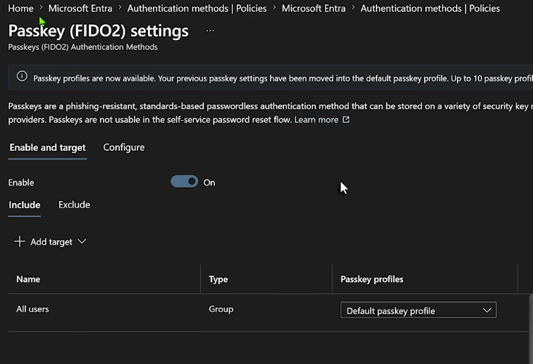
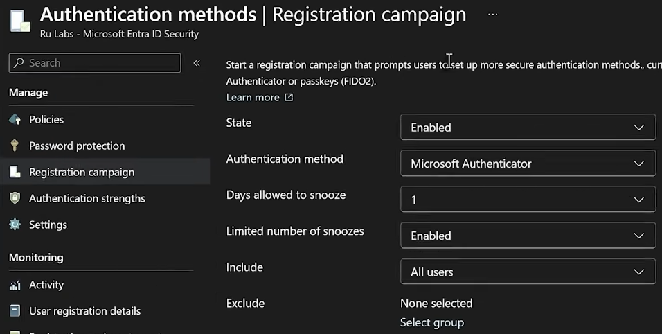

# Microsoft Entra - Passkey (FIDO2) Policy and Registration Campaign

## Purpose

This guide covers configuring the Passkey (FIDO2) authentication method in Microsoft Entra ID using passkey profiles, and driving user adoption with the Authentication methods registration campaign. It includes both portal and Microsoft Graph methods for every configuration item.

All statements below were verified against Microsoft Learn on 2026-07-27. Where documentation and portal behavior disagree, the discrepancy is called out explicitly.

---

## Licensing

Passkeys (FIDO2) are available in all Microsoft Entra ID editions, including Microsoft Entra ID Free. No extra licenses are required.

The registration campaign also has no license requirements, but it does require that the tenant use Microsoft Entra multifactor authentication — the nudge only fires for users completing MFA through the Entra MFA service.

Conditional Access authentication strengths (used in the optional enforcement step) require Microsoft Entra ID P1 or higher. In M365 Business Premium, P1 is included.

> [!note] Confidence
> High. Licensing statements are taken directly from Microsoft Learn and are consistent across the passkey and registration campaign documentation.

---

## Prerequisites

| Requirement | Detail |
| --- | --- |
| Admin role | Authentication Policy Administrator (minimum) for both passkey policy and registration campaign |
| Graph permissions | `Policy.Read.All` and `Policy.ReadWrite.AuthenticationMethod` |
| Windows devices | Entra joined: Windows 10 1903 or higher. Hybrid joined: Windows 10 2004 or higher |
| Microsoft Authenticator | If a profile allowing both device-bound and synced passkeys targets Authenticator: iOS 6.8.37 or Android 6.2507.4749 minimum |
| User registration | Users must have completed MFA within the past five minutes before they can register a passkey |
| Policy size | The Passkey (FIDO2) policy has a 20 KB size limit. Profiles cannot be saved past that limit |

### Known unsupported scenarios

- Passkey (FIDO2) registration is not supported for internal or external guest users, including B2B collaboration users in the resource tenant.
- If a user's UPN changes, existing passkeys cannot be modified. The user must delete the old passkey from Security info and register a new one.
- Linux is not supported for passkey sign-in or the registration nudge.

---

## Passkey types: device-bound vs. synced

Both types are FIDO2-based and both are phishing-resistant. The difference is where the private key lives and what that implies for assurance and recovery.

### Device-bound passkeys

The private key is created and stored on a single physical device and never leaves it.

Examples:
- FIDO2 security keys (YubiKey, Feitian, Token2, and similar)
- Windows Hello for Business
- Microsoft Entra passkeys on Windows
- Microsoft Authenticator on iOS and Android (Authenticator passkeys are device-bound only and cannot be synced)

Characteristics:
- Supports attestation, so Entra ID can cryptographically verify the make and model of the authenticator at registration.
- Supports AAGUID key restrictions, so you can allow or block specific vendors and models.
- Recovery is harder. There is no cloud backup. If the device is lost or destroyed, the user needs a second registered credential or a Temporary Access Pass (TAP) to recover.
- Appropriate for admins, executives, and any account where assurance matters more than convenience.

### Synced passkeys

The private key is created by the device hardware security module and encrypted on the local device. The encrypted key is then synced and stored in the cloud passkey provider. Other devices authenticated to that provider can then use the passkey. Exact behavior varies by provider.

Examples:
- Apple Passwords / iCloud Keychain
- Google Password Manager
- Samsung Pass
- Third-party managers such as 1Password and Bitwarden

Characteristics:
- Does not support attestation. Entra ID cannot guarantee any attribute about the passkey, including whether it is synced or device-bound.
- Recovery is simple. The credential follows the user across their devices in the same provider ecosystem.
- Microsoft's own guidance: treat synced passkeys as phishing-resistant credentials but with the same security posture as other unattested authenticators.
- Appropriate for general staff, BYOD, and users who move between devices.

### Comparison

| Attribute | Device-bound | Synced |
| --- | --- | --- |
| Private key location | Single physical device, never leaves | Encrypted, synced to provider cloud |
| Attestation support | Yes | No |
| AAGUID restrictions | Effective | Not a reliable control (unattested) |
| Cross-device availability | No (re-register per device) | Yes, within provider ecosystem |
| Recovery on device loss | Second credential or TAP required | Available on other synced devices |
| Phishing-resistant | Yes | Yes |
| Microsoft recommendation | Admins and highly privileged users | All non-admin users |

> [!warning] Attestation excludes synced passkeys
> If **Enforce attestation** is set to Yes on a passkey profile, only device-bound passkeys are allowed. Synced passkeys are automatically excluded from that profile. These two settings cannot coexist.

### Synced passkey provider platform support

Minimum device requirements, where columns are the platform the user signs in from:

| Provider | Windows | macOS | iOS | Android |
| --- | --- | --- | --- | --- |
| Apple Passwords (iCloud Keychain) | N/A | Built in, macOS 13+ | Built in, iOS 16+ | N/A |
| Google Password Manager | Built into Chrome | Built into Chrome | Built into Chrome, iOS 17+ | Built in (excluding Samsung), Android 9+ |
| Other providers (1Password, Bitwarden) | Browser extension | Browser extension | App, iOS 17+ | App, Android 14+ |

---

## Passkey profiles

### What they are

Passkey profiles replace the old single tenant-wide FIDO2 setting with named, group-scoped policy objects. Each profile defines:

| Option | Values |
| --- | --- |
| Passkey types | Device-bound, Synced, or both |
| Enforce attestation | Enabled, Disabled |
| Target specific authenticators | Allow or block by AAGUID |

Profiles are assigned to groups on the **Enable and target** tab. A group can be scoped to multiple profiles.

> [!important] Multi-profile evaluation logic
> When a user is scoped for multiple passkey profiles, registration and authentication succeed if the passkey fully satisfies the requirements of **at least one** scoped profile. There is no defined evaluation order. If a user is in an **excluded** group on the Passkey (FIDO2) policy, they are blocked from passkey registration and sign-in entirely, and exclusion takes precedence over any included group.

### Profile count limit

The portal banner in current tenants states up to 10 passkey profiles are supported. Microsoft Learn still documents a limit of three including the Default profile, with more "in development."

> [!note] Confidence — documentation discrepancy
> Medium-high that 10 is correct. The portal banner is authoritative over the Learn article here; the Learn page has not been updated since the June 2026 GA that raised the cap. The practical constraint is the 20 KB policy size limit regardless of the stated count. Verify the banner text in the target tenant before designing around more than three profiles.

### Opt-in is irreversible

When you opt in to passkey profiles, existing global Passkey (FIDO2) settings migrate automatically into a **Default passkey profile**. Once opted in, you cannot opt out.

---

## Part 1 — Enable passkey profiles and configure the Default profile

### Portal method

1. Sign in to the [Microsoft Entra admin center](https://entra.microsoft.com) as at least an **Authentication Policy Administrator**.
2. Browse to **Entra ID** > **Security** > **Authentication methods** > **Policies**.
3. Select **Passkey (FIDO2)**. Select the link in the banner text to opt in to passkey profiles.
4. On the **Configure** tab, set **Allow self-service set up** to **Yes**.
   - If set to No, users cannot register a passkey through [Security info](https://mysignins.microsoft.com/security-info) even when the method is enabled.
   - This is a **global** setting, not per-profile.
   - This toggle is also a hard prerequisite for a passkey registration campaign.
5. Select the **Default passkey profile** and set **Passkey types** to the types you want to allow.
6. Select **Save**.
7. On the **Enable and target** tab, set **Enable** to **On** and confirm the target assignment.



The screenshot above shows the baseline post-migration state: the method is enabled, **All users** is included as a target, and the group is assigned the **Default passkey profile**. This is the configuration to start from before adding a hardened admin profile.

### Graph method

Retrieve the current configuration first as a pre-change audit:

```powershell
Connect-MgGraph -Scopes "Policy.Read.All","Policy.ReadWrite.AuthenticationMethod"

Get-MgBetaPolicyAuthenticationMethodPolicyAuthenticationMethodConfiguration `
    -AuthenticationMethodConfigurationId "fido2" |
    ConvertTo-Json -Depth 10
```

Equivalent REST call:

```
GET https://graph.microsoft.com/beta/policies/authenticationMethodsPolicy/authenticationMethodConfigurations/fido2
```

Record the following before changing anything:
- Current `state`
- Current `isSelfServiceRegistrationAllowed`
- Whether a `passkeyProfiles` collection exists (if absent, the tenant is still on the legacy schema)
- Existing `includeTargets` and `excludeTargets`

> [!warning] Deprecated properties
> `isAttestationEnforced` and `keyRestrictions` as top-level properties on `fido2AuthenticationMethodConfiguration` are marked deprecated in the Graph reference in favor of the per-profile equivalents inside the `passkeyProfiles` collection. Build new tenant configurations through profiles from day one.
>
> Confidence: Medium. The deprecation is documented, but the specific removal date cited in community sources (October 2027) should be re-verified against the Graph changelog before being quoted to a client.

The `passkeyProfile` resource schema:

| Property | Values |
| --- | --- |
| `id` | GUID. The Default profile is `00000000-0000-0000-0000-000000000001` |
| `name` | Display name of the profile |
| `passkeyTypes` | `deviceBound`, `synced`, `unknownFutureValue` |
| `attestationEnforcement` | `disabled`, `registrationOnly`, `unknownFutureValue` |
| `keyRestrictions` | `fido2KeyRestrictions` object (AAGUID allow/block list) |

> [!note] Confidence
> Medium-high on the exact Graph payload shape. The `passkeyProfile` resource is documented in the **beta** Graph reference. Verify property names against the live tenant response before scripting production changes, and test the PATCH in a lab tenant first.

---

## Part 2 — Create a hardened profile for privileged accounts

### Recommended profile design

This is the standard two-profile pattern and matches Microsoft's own published use case:

| Profile | Target groups | Passkey types | Attestation | Key restrictions |
| --- | --- | --- | --- | --- |
| Default passkey profile | All users | Device-bound, Synced | Disabled | Disabled |
| Admin - device-bound only | IT admins, executives, privileged roles | Device-bound | Enabled | Optional (AAGUID allow list) |

Pair this with a dynamic security group for admin accounts so profile scoping stays accurate as staff change. Existing dynamic group pattern from the license-assignment work applies here:

```
(user.userPrincipalName -contains "adm.") and (user.accountEnabled -eq true)
```

Adjust the attribute to match the tenant's admin account naming convention or use `assignedRoles` if PIM-managed role assignment is in place.

### Portal method

1. On the **Configure** tab, select **+ Add passkey profile**.
2. Enter a **Name** (for example, `Admin - device-bound only`).
3. Set **Passkey types** to **Device-bound** only.
4. Set **Enforce attestation** to **Yes**.
5. Optionally set **Enforce key restrictions** to **Yes** and supply an AAGUID allow list for the approved security key models.
6. Select **Save**.
7. Go to **Enable and target**, select **Add target**, choose the admin group, and assign the new profile.

> [!warning] Attestation behavior
> Attestation enforcement governs registration only. Users who registered a passkey before attestation was enforced are **not** blocked from signing in with it afterward. Enforcing attestation does not retroactively invalidate existing credentials — plan a separate cleanup pass if that is the goal.

> [!warning] Key restriction behavior
> Key restrictions apply to both registration and authentication. If you remove a previously allowed AAGUID, users who already registered that model can no longer sign in with it. Also note that when **Enforce attestation** is No, AAGUID lists are a policy guide rather than an enforceable security control, because the AAGUID itself cannot be trusted.

### Finding an AAGUID

- Work with the vendor for the published AAGUID, or
- Consult the Microsoft Learn list of FIDO2 security keys eligible for attestation with Entra ID, or
- For an already-registered key, open the user's **Authentication methods** blade and view the passkey details.

### Deleting a profile

A profile can only be deleted when it is not assigned to any target. If the delete icon is greyed out, remove the assignments on **Enable and target** first, save, then delete.

---

## Part 3 — Registration campaign

The registration campaign nudges users to set up a targeted authentication method immediately after they complete MFA during a normal sign-in.



### Prerequisites specific to a passkey campaign

- Passkey (FIDO2) must be enabled in the Authentication methods policy.
- **Allow self-service setup** must be enabled in the passkey method configuration.
- The tenant must be using Entra MFA.

### One method at a time

A registration campaign can only target one authentication method at a time. You cannot run an Authenticator campaign and a passkey campaign simultaneously in the same tenant.

### State

Three values: **Disabled**, **Enabled**, **Microsoft managed**.

| State | Behavior |
| --- | --- |
| Disabled | No nudge |
| Enabled | Admin controls target method, snooze duration, snooze limit, and include/exclude targets |
| Microsoft managed | Microsoft sets target method, snooze duration, and snooze limit automatically. Those three cannot be configured. Include/exclude targets remain admin-controlled |

> [!important] Microsoft managed is a moving target
> Under Microsoft managed, Microsoft is incrementally rolling out these changes to tenants:
> - Targeted method changes from Microsoft Authenticator to passkeys (FIDO2)
> - Days allowed to snooze changes to 1 day, and becomes non-configurable
> - Limited number of snoozes changes to Disabled (unlimited), and becomes non-configurable
> - User targeting expands from voice/SMS users to all MFA-capable users
>
> For MSP-managed tenants, this is the argument for setting State to **Enabled** rather than Microsoft managed. Microsoft managed means targeting and snooze behavior can change on a client tenant without a change window.

The screenshot above shows a tenant in the **Enabled** state targeting Microsoft Authenticator with a 1-day snooze and limited snoozes enabled — an explicitly admin-controlled configuration, not Microsoft managed.

> [!note] Microsoft managed edge case
> If the tenant targets specific AAGUIDs in the passkey policy, the targeted method will **not** switch to passkeys under Microsoft managed mode. The campaign stays on Authenticator.

### Authentication method

| Value | Graph value | Effect |
| --- | --- | --- |
| Microsoft Authenticator | `microsoftAuthenticator` | Nudge to install and set up Authenticator for push notifications |
| Passkey | `fido2` | Nudge to register a passkey (covers both synced and device-bound) |

---

## Part 4 — How snooze works

Two independent settings control the snooze experience.

### Days allowed to snooze

Graph property: `snoozeDurationInDays`

- Sets the period between two successive interrupt prompts. If set to 3, a user who skipped is not prompted again for 3 days.
- Range: 0 to 14. Default: 1.
- A value of **0** means the user is nudged on **every** MFA attempt.
- This is a **tenant-wide** setting. You cannot set different snooze durations per group.

### Limited number of snoozes

Graph property: `enforceRegistrationAfterAllowedSnoozes`

- **Enabled** (`true`): the user can skip the prompt **3 times**, after which registration is forced. The count of 3 is fixed and not adjustable.
- **Disabled** (`false`): the user can snooze indefinitely and avoid registering.
- The snooze count is tracked **per user** and **persists** across campaign restarts and configuration changes, including changes to the targeted method.

### Behavioral details worth documenting

- **Closing the browser counts as a snooze.** If registration is required after three snoozes, the user is nudged on their next sign-in.
- **Registration errors do not consume a snooze.** If a user hits an error during passkey registration, the error screen's skip option does not count toward the limited skip count, so a broken registration cannot block sign-in.
- **The passkey nudge is per device and browser, not per account.** Entra evaluates whether the user has a local passkey for the current device/browser combination. A user with Windows Hello for Business is not nudged on Windows but will be nudged on a Mac.
- **No nudge in the same session as registration.** A user who just completed MFA registration is not nudged in that same sign-in session.
- **Guest/B2B users** are nudged for Authenticator campaigns if included, but not for passkey campaigns, since passkey registration is not supported for guests.

### Nudge suppression conditions

The nudge does not appear when any of the following apply:

- The user is already signed in via an SSO session
- The user is on a mobile device (registration campaign is not available on mobile)
- The user is on Linux
- A Conditional Access policy blocks access to the **Register security information** page
- A terms of use screen is presented during sign-in
- Conditional Access custom controls redirect the sign-in
- The user is in an out-of-the-box experience, or a browser view embedded in Windows settings

> [!warning] Microsoft managed + hardened passkey profiles = no nudge
> Under Microsoft managed mode the passkey nudge is evaluated per user, and users whose passkey profile has **any** of the following restrictions do not see the nudge at all:
> - Synced only
> - Device-bound only
> - Attestation enforced
> - AAGUID restrictions
>
> This is the single biggest gotcha in the feature. Hardening the passkey profile for admins silently disables the registration campaign for exactly those users. If the goal is to drive admin passkey adoption, use State = **Enabled** and a manually targeted campaign, or drive admin registration through TAP issuance and Conditional Access enforcement instead.

### Passkey nudge evaluation by platform

A user needs at least one matching credential type for the nudge to be suppressed on that device and browser combination.

| Credential | Windows + Chrome | Windows + Other | Mac + Chrome | Mac + Other | iOS | Android |
| --- | --- | --- | --- | --- | --- | --- |
| Windows Hello for Business | Yes | Yes | No | No | No | No |
| Microsoft Entra passkey on Windows | Yes | Yes | No | No | No | No |
| Google Password Manager | Yes | No | Yes | No | No | Yes |
| iCloud Keychain (including Managed) | No | No | Yes | Yes | Yes | No |
| Mac Platform SSO | No | No | Yes | Yes | No | No |
| Samsung Pass | No | No | No | No | No | Yes |
| Any non-platform provider (security keys, authenticator apps) | Yes | Yes | Yes | Yes | Yes | Yes |

---

## Part 5 — Configure the registration campaign

### Portal method

1. Sign in to the Microsoft Entra admin center as at least an **Authentication Policy Administrator**.
2. Browse to **Entra ID** > **Authentication methods** > **Registration campaign** and select **Edit**.
3. Set **State** to **Enabled**.
4. Set **Authentication method** to **Passkey** or **Microsoft Authenticator**.
5. Set **Days allowed to snooze** (0–14).
6. Set **Limited number of snoozes** to Enabled or Disabled.
7. Configure **Include** and **Exclude** targets.
8. Select **Save**.

> [!note] Exclusion precedence
> If a user is in both an included group and an excluded group, the user is **excluded**.

### Graph method

```
GET  https://graph.microsoft.com/v1.0/policies/authenticationmethodspolicy
PATCH https://graph.microsoft.com/v1.0/policies/authenticationmethodspolicy
```

#### All users, target passkey

```json
{
  "registrationEnforcement": {
    "authenticationMethodsRegistrationCampaign": {
      "snoozeDurationInDays": 1,
      "enforceRegistrationAfterAllowedSnoozes": true,
      "state": "enabled",
      "excludeTargets": [],
      "includeTargets": [
        {
          "id": "all_users",
          "targetType": "group",
          "targetedAuthenticationMethod": "fido2"
        }
      ]
    }
  }
}
```

#### All users, target Microsoft Authenticator

```json
{
  "registrationEnforcement": {
    "authenticationMethodsRegistrationCampaign": {
      "snoozeDurationInDays": 1,
      "enforceRegistrationAfterAllowedSnoozes": true,
      "state": "enabled",
      "excludeTargets": [],
      "includeTargets": [
        {
          "id": "all_users",
          "targetType": "group",
          "targetedAuthenticationMethod": "microsoftAuthenticator"
        }
      ]
    }
  }
}
```

#### Specific group included, break-glass group excluded

```json
{
  "registrationEnforcement": {
    "authenticationMethodsRegistrationCampaign": {
      "snoozeDurationInDays": 3,
      "enforceRegistrationAfterAllowedSnoozes": true,
      "state": "enabled",
      "excludeTargets": [
        {
          "id": "<BREAK-GLASS-GROUP-GUID>",
          "targetType": "group"
        }
      ],
      "includeTargets": [
        {
          "id": "<PILOT-GROUP-GUID>",
          "targetType": "group",
          "targetedAuthenticationMethod": "fido2"
        }
      ]
    }
  }
}
```

#### Property reference

| Property | Values | Notes |
| --- | --- | --- |
| `snoozeDurationInDays` | 0–14 | Default 1. 0 nudges on every MFA attempt |
| `enforceRegistrationAfterAllowedSnoozes` | `true` / `false` | Default true. True forces registration after 3 snoozes |
| `state` | `enabled` / `disabled` / `default` | `default` means Microsoft managed |
| `includeTargets` | `targetType` (`user`/`group`), `id` (GUID or `all_users`), `targetedAuthenticationMethod` (`microsoftAuthenticator`/`fido2`) | |
| `excludeTargets` | `targetType`, `id` | Exclusion wins over inclusion |

Finding GUIDs: the **Object ID** on the user or group properties page in the Entra admin center.

---

## Part 6 — Optional enforcement with Conditional Access

Registration campaigns nudge. They do not enforce sign-in method. To actually require passkeys for sensitive resources, use an authentication strength.

1. Sign in as at least a **Conditional Access Administrator**.
2. Browse to **Entra ID** > **Authentication methods** > **Authentication strengths**.
3. Either use the built-in **Phishing-resistant MFA** strength, or select **New authentication strength**.
4. For a custom strength, provide a Name, select **Passkeys (FIDO2)**, and optionally use **Advanced options** > **Add AAGUID** to restrict to specific models.
5. Reference the strength in a Conditional Access policy grant control.

Standard rollout sequence: report-only first, exclude break-glass accounts, pilot group, then broad enablement.

---

## Rollout considerations

### The March 2026 profile migration side effect

On tenants where Passkey (FIDO2) was already enabled **and** attestation was not enforced, the automatic migration to passkey profiles resulted in **synced passkeys becoming enabled**. This was a behavior change, not a new opt-in.

For any existing client tenant, audit the Default profile's `passkeyTypes` value and confirm it matches intent rather than assuming the migrated state is what the client wants.

### Bootstrapping

New users have no credential to register a passkey with. Use a **Temporary Access Pass** to break the chicken-and-egg problem — a time-limited passcode lets a user register a passkey without ever using a password. Enable the TAP method in the Authentication methods policy before starting a passkey rollout.

### Recommended sequence for a client tenant

1. Pre-change audit: capture the current `fido2` configuration and registration campaign state via Graph, save to the client's change record.
2. Enable TAP if not already enabled.
3. Opt in to passkey profiles (irreversible — get client approval first).
4. Set the Default profile passkey types deliberately.
5. Create the admin device-bound profile and target it to the admin dynamic group.
6. Confirm **Allow self-service set up** is Yes.
7. Pilot: registration campaign State = Enabled, target = passkey, scoped to a pilot group, snooze 3 days, limited snoozes Disabled during pilot.
8. Broad rollout: expand include target, tighten snooze to 1 day, set limited snoozes to Enabled.
9. Enforce with a Conditional Access authentication strength, report-only first.

---

## Verification

### Registration coverage

**Entra ID** > **Authentication methods** > **User registration details** — filter on passkey registration to track adoption.

**Entra ID** > **Authentication methods** > **Activity** — the Authentication methods activity report shows registration counts by method.

### Confirm applied policy via Graph

```powershell
Connect-MgGraph -Scopes "Policy.Read.All"

# Passkey (FIDO2) method configuration including profiles
Get-MgBetaPolicyAuthenticationMethodPolicyAuthenticationMethodConfiguration `
    -AuthenticationMethodConfigurationId "fido2" |
    ConvertTo-Json -Depth 10

# Registration campaign
(Get-MgPolicyAuthenticationMethodPolicy).RegistrationEnforcement |
    ConvertTo-Json -Depth 10
```

### Check policy size against the 20 KB limit

Save the `GET` response for `authenticationmethodspolicy` to a `.txt` file and check the file size in Properties. Reference sizes from Microsoft:

| Item | Approximate size |
| --- | --- |
| Base passkey policy, unchanged | 1.44 KB |
| Target with 1 applied profile | 0.23 KB |
| Target with 5 applied profiles | 0.4 KB |
| Profile with no AAGUIDs | 0.4 KB |
| Profile with 10 AAGUIDs | 0.3 KB |

---

## Troubleshooting

| Symptom | Likely cause |
| --- | --- |
| User cannot register a passkey from Security info | **Allow self-service set up** is set to No, or the user is in an excluded group on the Passkey (FIDO2) policy |
| No registration nudge appears | SSO session, mobile device, Linux, CA policy blocking Register security information, terms of use screen, or CA custom controls |
| No nudge for admins specifically | Microsoft managed state combined with a restricted passkey profile (synced only, device-bound only, attestation enforced, or AAGUID restrictions) |
| Nudge appears despite user already having a passkey | Expected. The nudge is per device and browser, not per account |
| Synced passkey rejected at registration | Attestation is enforced on every profile scoped to that user |
| Guest user cannot register a passkey | Not supported. Passkey registration is unavailable for internal and external guests |
| User cannot sign in with a previously working key | An AAGUID was removed from an allow list on a key restriction policy |
| Cannot delete a passkey profile | Profile is still assigned to a target on Enable and target |
| Cannot save a new profile | 20 KB policy size limit reached |

---

## Source references

- [Passkeys (FIDO2) authentication method in Microsoft Entra ID](https://learn.microsoft.com/en-us/entra/identity/authentication/concept-authentication-passkeys-fido2)
- [How to enable passkeys (FIDO2) in Microsoft Entra ID](https://learn.microsoft.com/en-us/entra/identity/authentication/how-to-authentication-passkeys-fido2)
- [Run a registration campaign to set up passkey or Microsoft Authenticator](https://learn.microsoft.com/en-us/entra/identity/authentication/how-to-mfa-registration-campaign)
- [Enable and support passkeys in Authenticator for Microsoft Entra ID](https://learn.microsoft.com/en-us/entra/identity/authentication/how-to-enable-authenticator-passkey)
- [Passkey FAQs](https://learn.microsoft.com/en-us/entra/identity/authentication/passkey-faq)
- [FIDO2 security keys eligible for attestation with Microsoft Entra ID](https://learn.microsoft.com/en-us/entra/identity/authentication/concept-fido2-hardware-vendor)
- [Protecting authentication methods in Microsoft Entra ID (Microsoft managed values)](https://learn.microsoft.com/en-us/entra/identity/authentication/concept-authentication-default-enablement)
- Graph beta reference: `passkeyProfile` resource type

---

## Related notes

- M365 Security Standards - Manual Configuration Guide
- Entra ID - Dynamic Security Groups for License Assignment
- M365 Business Premium - Email Security Hardening
