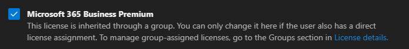

# Part 1 - Group-Based Licensing

*Part 1 of the [Intune Zero to Hero](./README.md) series.*

---

## Summary

This series is built around **Microsoft 365 Business Premium**. Part 1 covers **group-based licensing** — assigning a license to an Entra security group instead of to individual users. Once a group is licensed, adding a user to the group automatically grants the license, and removing them revokes it. This is the foundation the rest of the series builds on, since later policies and apps target these same licensing groups.

Although the examples use Business Premium, the same process applies to **any license** — only the license name in the group name changes.

---

## Group Naming Convention

Name the licensing group so its purpose is obvious at a glance. Example for Business Premium:

**`SG - GL - Business Premium - User`**

| Segment | Meaning |
|---|---|
| **SG** | Security Group |
| **GL** | Group License |
| **Business Premium** | License (product) name — change this per license |
| **User** | Who the group is assigned to |

---

## Configuration Steps

1. **Create a security group** in Microsoft Entra, using the naming convention above (e.g., `SG - GL - Business Premium - User`).
2. **Add the users** who should receive the license to the group.
3. In the Microsoft 365 admin center, go to **Billing > Licenses**.
4. **Open the product** (e.g., Microsoft 365 Business Premium).
5. **Assign the group** to the license so every member inherits it.

---

## Verifying the Assignment

On a user's account in the Microsoft 365 admin center, a group-inherited license shows the message below. This confirms the license came from the group rather than a direct assignment:

---

## Notes

- License changes follow group membership: add a user to the group to grant the license, remove them to revoke it.
- The naming pattern is reusable for any license — only the product-name segment changes (e.g., `SG - GL - Exchange Online (Plan 1) - User`).
- A user can hold both a group-inherited license and a direct license. To move fully to group-based licensing, remove any direct assignments so the group is the single source of truth.

---

**Next:** [Part 2 - Microsoft Entra Device Settings](./Part%202%20-%20Microsoft%20Entra%20Device%20Settings.md) →

*[Intune Zero to Hero](./README.md) series · [Microsoft Intune](../README.md) · [Root index](../../README.md)*
